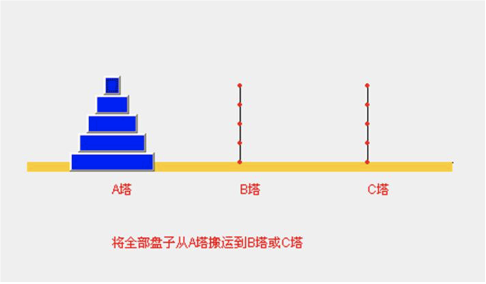
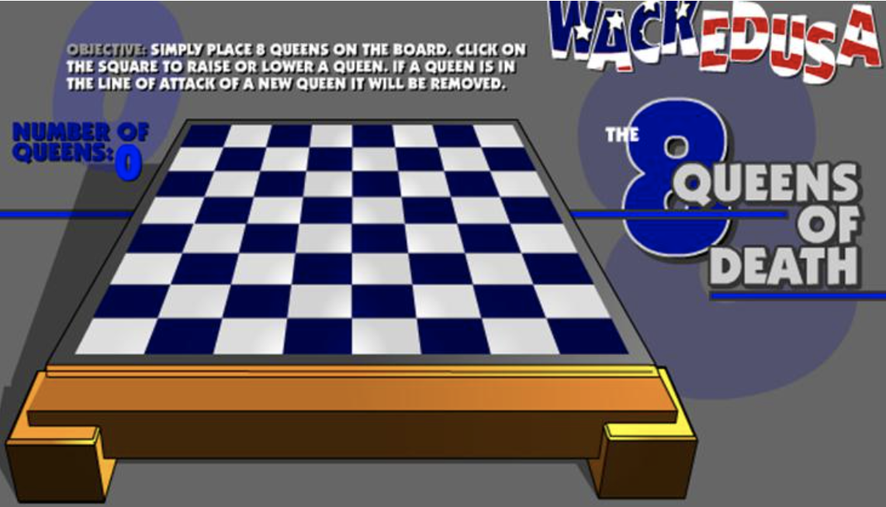
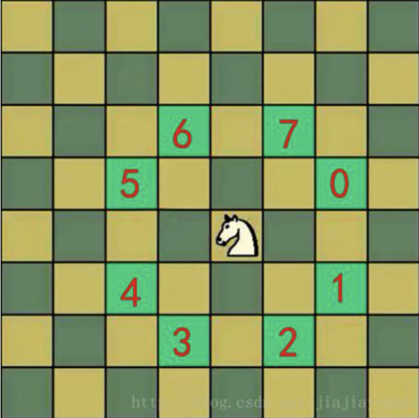

## 1.1 数据结构和算法内容介绍

### 1.1.1 先看几个经典的算法面试题

1. 字符串匹配问题：

- 1) 有一个字符串 `str1 = "硅硅谷尚硅谷你尚硅尚硅谷你尚硅谷你尚硅你好"`，和一个子串 `str2 = "尚硅谷你尚硅你"`；
- 2) 现在要判断 `str1` 是否含有 `str2`，如果存在，就返回第一次出现的位置，如果没有，则返回 `-1`；
- 3) 要求用最快的速度来完成匹配；
- 4) 你的思路是什么？

- 暴力匹配[简单，但是效率低]
- KMP算法《部分匹配表》

2. 汉诺塔游戏：

请完成汉诺塔游戏的代码，要求：

- 1) 将 A 塔的所有圆盘移动到 C 塔；
- 2) 并且规定，在小圆盘上不能放大圆盘；
- 3) 在三根柱子之间一次只能移动一个圆盘。

3. 八皇后问题：

八皇后问题，是一个古老而著名的问题，是回溯算法的典型案例。该问题是国际西洋棋棋手马克斯·贝瑟尔于1848年提出：在 8×8 格的国际象棋上摆放八个皇后，使其不能互相攻击，即：任意两个皇后都不能处于同一行、同一列或同一斜线上，问有多少种摆法。【92】=>分治算法。

4. 马踏棋盘算法介绍和游戏演示

- 1) 马踏棋盘算法也被称为骑士周游问题；
- 2) 将马随机放在国际象棋的 8×8 棋盘Board[0～7][0～7]的某个方格中，马按走棋规则（马走日字）进行移动。要求每个方格只进入一次，走遍棋盘上全部 64 个方格；
- 3) 游戏演示：http://www.4399.com/flash/146267_2.htm ；
- 4) 会使用到图的深度优化遍历算法(DFS)+贪心算法优化。

### 1.1.2 数据结构和算法的重要性

- 1) **算法是程序的灵魂**，优秀的程序可以在海量数据计算时，依然保持高速计算；
- 2) 一般来讲程序会使用了内存计算框架（比如 Spark）和缓存技术（比如 Redis 等）来优化程序，再深入的思考一下，这些计算框架和缓存技术，它的核心功能是哪个部分呢？
- 3) 拿实际工作经历来说，在 Unix 下开发服务器程序，功能是要支持上千万人同时在线，在上线前，做内测，一切 OK，可上线后，服务器就支撑不住了，公司的 CTO 对代码进行优化，再次上线，坚如磐石。你就能感受到程序是有灵魂的，就是算法；
- 4) 目前程序员面试的门槛越来越高，很多一线 IT 公司（大厂），都会有数据结构和算法面试题（负责的告诉你，肯定有的）；
- 5) 如果你不想永远都是代码工人，那就花时间来研究下数据结构和算法。

### 1.1.3 本套数据结构和算法内容介绍

### 1.1.4 课程亮点和授课方式

- 1) 课程深入，非蜻蜓点水；
- 2) 课程成体系，非星星点灯；
- 3) 高效而愉快的学习，数据结构和算法很有用，很好玩；
- 4) 数据结构和算法很重要，但是相对困难，我们努力做到通俗易懂；
- 5) 采用应用场景 -> 数据结构或算法 -> 剖析原理 -> 分析实现步骤（图解）-> 代码实现的步骤讲解[比如:八皇后问题和动态规划算法]；
- 6) 课程目标：让大家掌握本质,到达能在工作中灵活运用解决实际问题和优化程序的目的。
