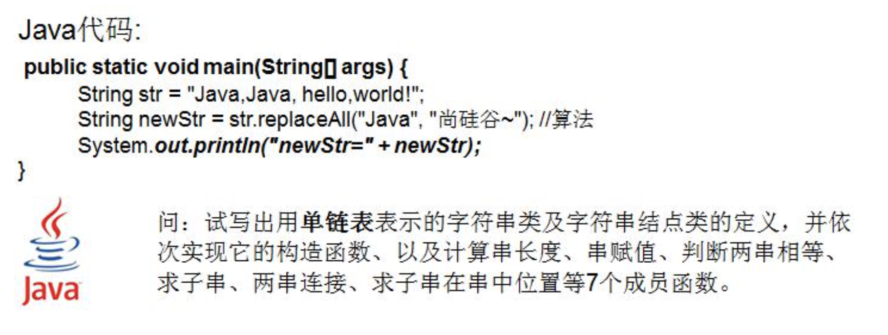
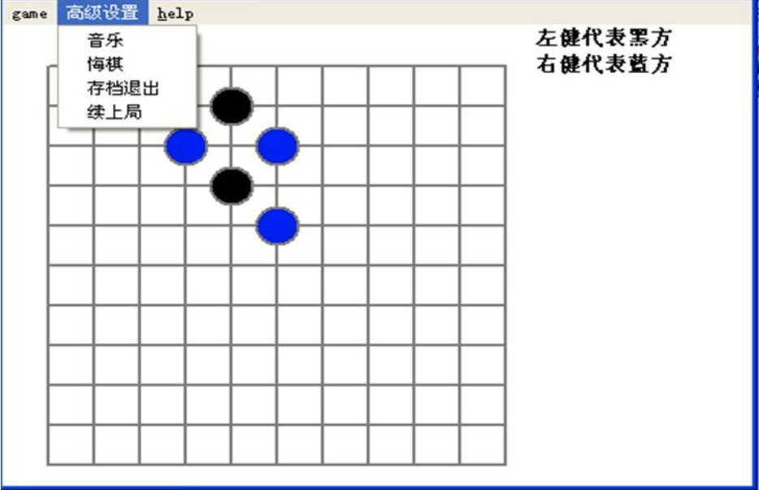
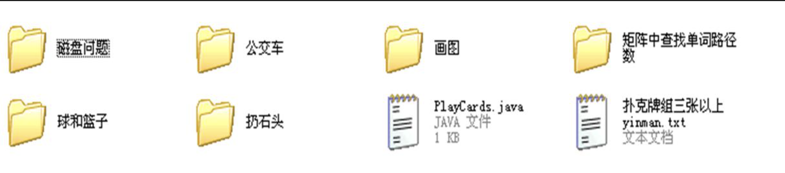

## 2.1 数据结构和算法的关系

- 1) 数据 data 结构（structure）是一门研究组织数据方式的学科，有了编程语言也就有了数据结构。学好数据结构可以编写出更加漂亮，更加有效率的代码；
- 2) 要学习好数据结构就要多多考虑如何将生活中遇到的问题，用程序去实现解决；
- 3) 程序 = 数据结构 + 算法；
- 4) 数据结构是算法的基础，换言之，想要学好算法，需要把数据结构学到位。

## 2.2 看几个实际编程中遇到的问题

### 2.2.1 问题一-字符串替换问题

小结：需要使用到单链表数据结构

### 2.2.2 一个五子棋程序

如何判断游戏的输赢，并可以完成存盘退出和继续上局的功能

- 1) 棋盘二维数组 => (稀疏数组) -> 写入文件【存档功能】
- 2) 读取文件 -> 稀疏数组 -> 二维数组 -> 棋盘【接上局】

### 2.2.3 约瑟夫（Josephu）问题（丢手帕问题）

- 1) Josephu问题为：设编号为 1，2，...n 的 n 个人围坐一圈，约定编号为 k（1<=k<=n）的人从 1 开始报数，数到 m 的那个人出列，它的下一位又从 1 开始报数，数到 m 的那个人又出列，依次类推，直到所有人出列为止，由此产生一个出队编号的序列；
- 2) 提示：用一个不带头结点的循环链表来处理 Josephu 问题：先构成一个有 n 个结点的单循环链表（单向环形链表），然后由 k 结点起从 1 开始计数，计到 m 时，对应结点从链表中删除，然后再从被删除结点的下一个结点又从 1 开始计数，直到最后一个结点从链表中删除算法结束；
- 3) 小结：完成约瑟夫问题，需要使用到单向环形链表这个数据结构。

### 2.2.4 其它常见算法问题：

- 1) 修路问题 -> 最小生成树(加权值)【数据结构】+ 普利姆算法
- 2) 最短路径问题 -> 图 + 弗洛伊德算法
- 3) 汉诺塔 -> 分支算法
- 4) 八皇后问题 -> 回溯法

## 2.3 线性结构和非线性结构

数据结构包括：线性结构和非线性结构。

### 2.3.1 线性结构

- 1) 线性结构作为最常用的数据结构，其特点是数据元素之间存在一对一的线性关系；
- 2) 线性结构有两种不同的存储结构，即顺序存储结构(数组)和链式存储结构(链表)。顺序存储的线性表称为顺序表，顺序表中的存储元素是连续的；
- 3) 链式存储的线性表称为链表，链表中的存储元素不一定是连续的，元素节点中存放数据元素以及相邻元素的地址信息；
- 4) 线性结构常见的有：数组、队列、链表和栈，后面我们会详细讲解。

### 2.3.2 非线性结构

非线性结构包括：二维数组，多维数组，广义表，树结构，图结构
