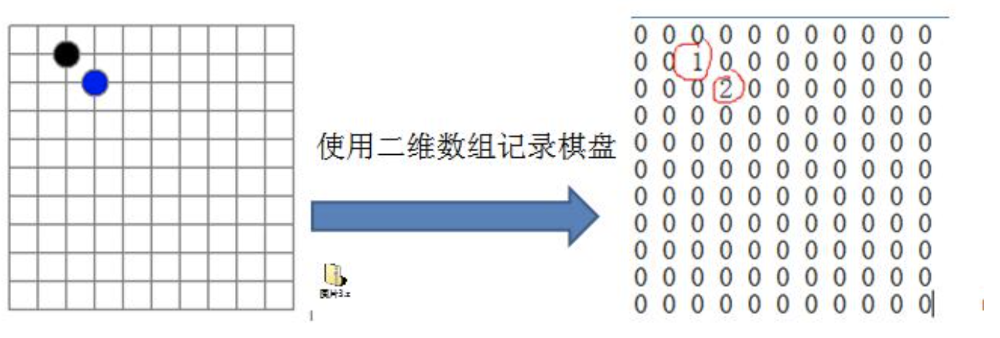
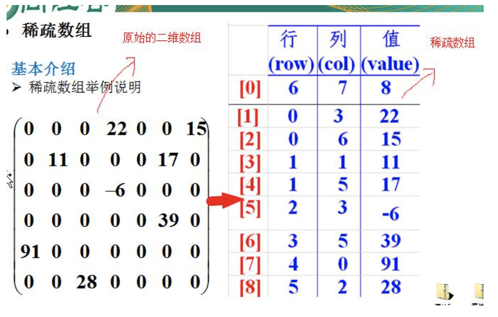
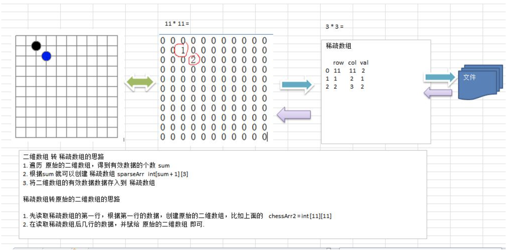

## 3.1 稀疏 sparsearray 数组

### 3.1.1 先看一个实际的需求

- 编写的五子棋程序中，有存盘退出和续上盘的功能。

- 分析问题：因为该二维数组的很多值是默认值 0，因此记录了很多没有意义的数据 -> 稀疏数组。

### 3.1.2 基本介绍

当一个数组中大部分元素为 ０，或者为同一个值的数组时，可以使用稀疏数组来保存该数组。

稀疏数组的处理方法是：

- 1) 记录数组一共有几行几列，有多少个不同的值；
- 2) 把具有不同值的元素的行列及值记录在一个小规模的数组中，从而缩小程序的规模。

稀疏数组举例说明

### 3.1.3 应用实例

- 1) 使用稀疏数组，来保留类似前面的二维数组（棋盘、地图等等）；
- 2) 把稀疏数组存盘，并且可以从新恢复原来的二维数组数；
- 3) 整体思路分析

### 3.1.4 课后练习要求：

- 1) 在前面的基础上，将稀疏数组保存到磁盘上，比如 map.data；
- 2) 恢复原来的数组时，读取 map.data 进行恢复。